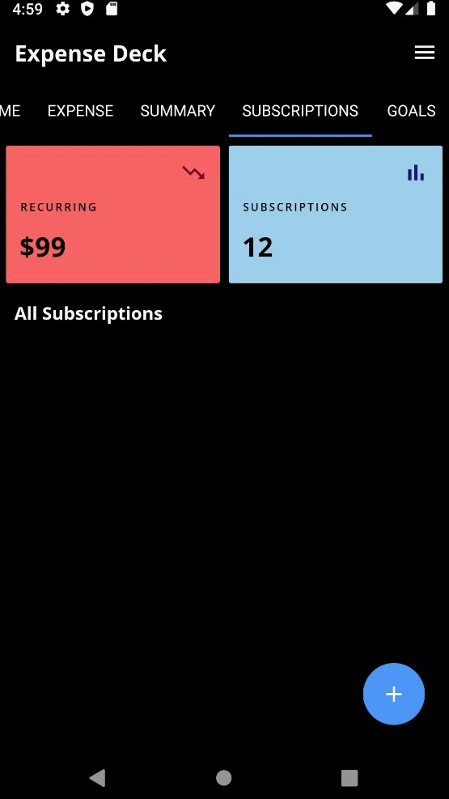
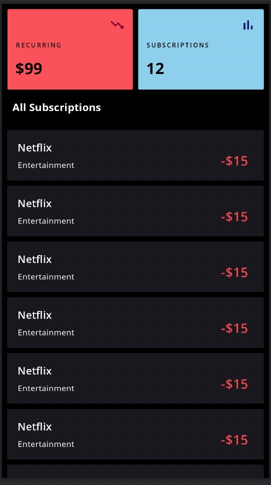
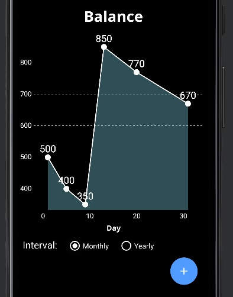
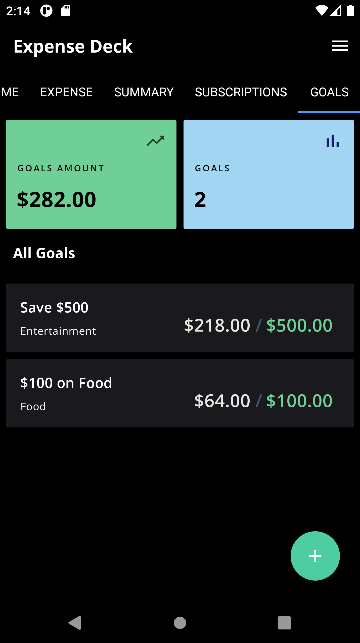

    

# Expense Deck

Expense Deck is an Android application that keeps track of your monthly expenses. Not only does Expense Deck chart your expenses but it also provides payment reminders, speech to text for transactions, creating and tracking goals and monthly expense reports. Users can set up alerts for different spending categories and monitor their current balance, past transactions, subscriptions, monthly income and can view their current net worth. 

## GUI

  
  
  
    

